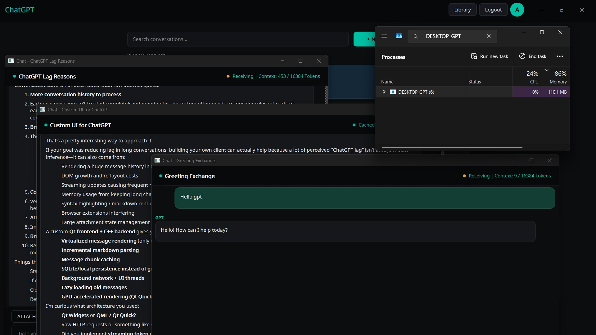
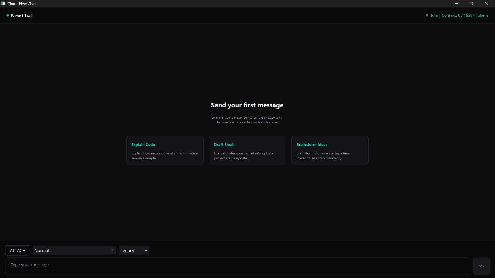

# Better-GPT





This is a Windows Native Client Made Using C++20, Qt 6 and CEF (chromium Embedded Worker)
Its More Optimized compared To native Electron Apps , Most of The Memory OverHead would be User Payload (User Chat in memory and User Files Cached On their Disk) At current Benchmarks this App Is More Superior compared to official Electron App , Once 
## ✨ Features

- **MultiTasking**: Work at Multiple Large Chats at same time ,without worrying about Perfomance 

- **Context Window**: Currently Provided a rough estimation of Context Window , will make it more accurate in future updates as i am still writing algorithm seperately to support images and files .

- **Premium UI**: Built with Qt 6, featuring modern dark-mode aesthetics, custom window chromes, and smooth context panels.

- **Selecting Model**: Currently Free Tier User can only Auto Select as Models in browser Side but our App Allowes them to choose Legacy or Gpt 5 as backend allows User to select between this But its Blocked By Browser UI

Upcoming Features :-
-  **Chat Download**: Downloading Chats easily .
-  **Search & History**: (Present currently in App just Jumping to chat is not ready Yet)
-  **Better RT and Supporting all features **: Making Rich Text Format close to browser level and implementing all features like createimage and deep research  .
`  

##  Technology Stack

- **Core**: C++20
- **GUI Framework**: Qt 6.11.1 (Widgets, Core, Gui)
- **Web Engine / Rendering**: CEF (Chromium Embedded Framework) wrapper via `libcef_dll_wrapper`
- **Build System**: CMake (Minimum version 3.16)
- **OS**: Windows (Utilizing `winhttp`, `dwmapi`, `user32`)
- **Compiler**: MSVC 2022

## 🚀 Building from Source

### Prerequisites

1. **Visual Studio 2022** with C++ desktop development workload.
2. **CMake 3.16** or higher.
3. **Qt 6.11.1** installed (make sure the MSVC 2022 64-bit component is selected).
4. **CEF binaries** placed in the `tools/Release` and `tools/Resources` directories (as configured in CMake).

### Build Steps

1. **Clone the repository:**
   ```bash
   git clone https://github.com/adityarawat1223/Better-GPT.git
   cd Better-GPT
   ```

2. **Configure with CMake:**
   Ensure your `CMAKE_PREFIX_PATH` is correctly pointing to your Qt 6 installation (default in `CMakeLists.txt` is `C:/Qt/6.11.1/msvc2022_64`).

   ```bash
   mkdir build
   cd build
   cmake ..
   ```

3. **Build the project:**
   ```bash
   cmake --build . --config Release
   ```

4. **Run the executable:**
   The output binary, CEF resources, and Qt deployment dependencies (via `windeployqt`) will be automatically copied to the `out/Release` directory.
   ```bash
   cd ../out/Release
   ./DESKTOP_GPT.exe
   ```

## Libraries Used 

Grateful for those
[Nlohmann Json](https://github.com/nlohmann/json)
[stduuid](https://github.com/mariusbancila/stduuid)

##  License

This project is licensed under the [MIT License](LICENSE) - see the LICENSE file for details.